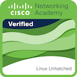

# 🎓 IT Certification Portfolio

Welcome to my repository for professional development! Here, I document my learning progress in systems integration, and keep all official certificates, badges, and practical lab exercises organized.

## 🏆 Certifications Overview

| Technology | Course / Certificate | Official Verification | Download |
| :--- | :--- | :--- | :--- |
| **Linux (NDG)** | Linux Unhatched |  | [📄 PDF Certificate](./Linux/Linux_Unhatched_certificate_a-jkel-yahoo-com_34afb28a-df6c-45e0-abe4-43ff023e3cac.pdf) |
| **Cisco** | Getting Started with Cisco Packet Tracer |    *(Cert ID: 49afa879-6f19-4361-9db9-7af92c41913f)* | [📄 PDF Certificate](./Cisco/Getting_Started_with_Cisco_Packet_Tracer_certificate_a-jkel-yahoo-com_49afa879-6f19-4361-9db9-7af92c41913f.pdf) |

---

## 📂 Repository Structure

* Inside the respective subfolders within `badges_and_certificates/`, you will find the official PDF documents as well as my completed practical lab exercises (e.g., solved `.pka` files from Cisco Packet Tracer).