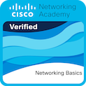
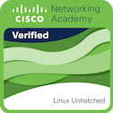
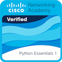

# 🎓 IT Certification Portfolio

Welcome to my repository for professional development! Here, I document my learning progress in systems integration, and keep all official certificates, badges, and practical lab exercises organized.

## 🏆 Certifications Overview

| Technology | Course / Certificate | Official Verification | Download |
| :--- | :--- | :--- | :--- |
| **Cisco** | Networking Basics |  | [📄 PDF Certificate](./Cisco/Networking_Basics_certificate_a-jkel-yahoo-com_e17e577e-7b2a-4289-9aee-6f051c6e707f.pdf)
| **Cisco** | Getting Started with Cisco Packet Tracer |    *(Cert ID: 49afa879-6f19-4361-9db9-7af92c41913f)* | [📄 PDF Certificate](./Cisco/Getting_Started_with_Cisco_Packet_Tracer_certificate_a-jkel-yahoo-com_49afa879-6f19-4361-9db9-7af92c41913f.pdf) |
| **Linux (NDG)** | Linux Unhatched |  | [📄 PDF Certificate](./Linux/Linux_Unhatched_certificate_a-jkel-yahoo-com_34afb28a-df6c-45e0-abe4-43ff023e3cac.pdf) |
**Python** | Python Essentials 1 |  | [📄 PDF Certificate](./Python/Python_Essentials_1_certificate_a-jkel-yahoo-com_e8d9955a-8667-4e11-9df3-ead19c8fb94f.pdf) |

---
